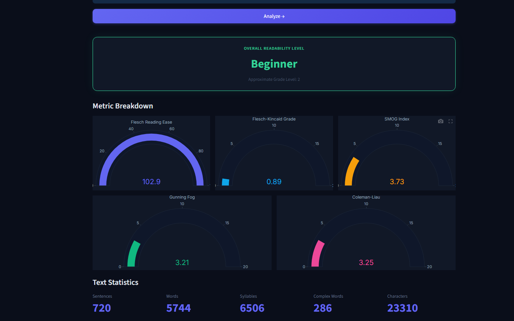

# 🚀 Milestone 2 – Security & UI Enhancement

## 📌 Overview

In this milestone, major security and usability improvements were implemented in the PolicyNav authentication system.

---

## 🔐 New Features Added

### ✅ OTP Verification in Signup
- 6-digit OTP generated securely
- Email-based verification
- Prevents fake account creation

### ✅ OTP Verification in Forgot Password
- OTP required before resetting password
- Increased account recovery security

### ✅ Improved Input Validation
- Prevents blank/space-only entries
- Stronger password rules

### ✅ UI & Readability Enhancements
- Cleaner layout
- Better button alignment
- Improved feedback messages

---

## 🖼️ Screenshots

### 🔐 OTP Verification (Signup)

  

---

### 🔁 Forgot Password OTP

  

---

### 🎨 UI Readability Improvements

  

---

## 🛠️ Tech Stack

- Python
- Streamlit
- JWT Authentication
- Bcrypt
- SQLite
- Email OTP System

---

## 📂 Files Included

- `app.py` – Main application file
- `requirements.txt` – Dependencies
- Screenshots of new features

---

## 🎯 Outcome

This milestone significantly improved:
- Application security
- User validation
- Overall UI experience
