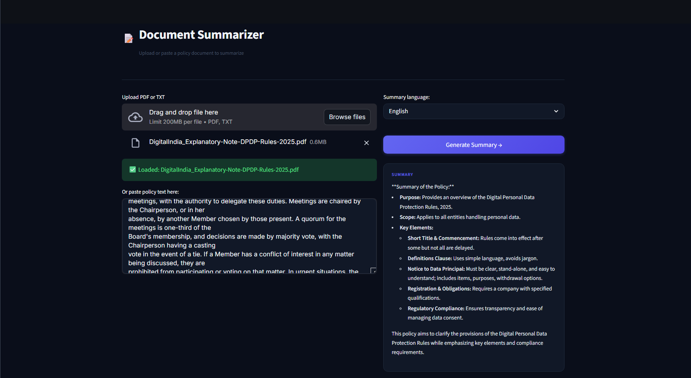
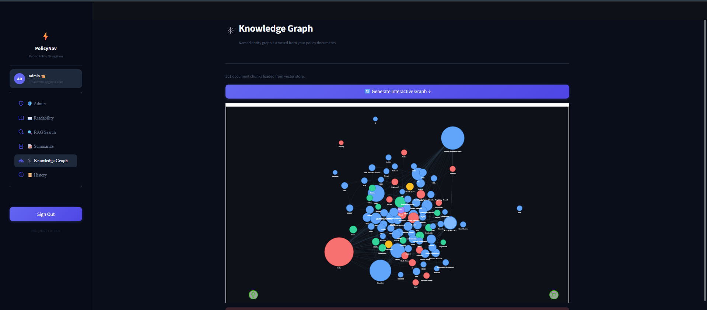

# 🚀 PolicyNav – Milestone 3

## 📌 Overview

Milestone 3 enhances PolicyNav into an **AI-powered policy assistant** by integrating advanced LLM-based features like **RAG search, summarization, knowledge graphs, and history tracking**, along with improved system flow.

---

## 🔥 Features Implemented in Milestone 3

### 🧠 RAG-Based Policy Search

* Implemented Retrieval-Augmented Generation (RAG)
* Retrieves relevant policy data before generating responses
* Improves accuracy and contextual understanding

📸


---

### ✍️ Policy Summarization

* Automatically summarizes complex policy documents
* Helps users quickly understand key information
* Uses LLM-based processing

📸


---

### 🕸️ Knowledge Graph Visualization

* Displays relationships between policy entities
* Provides structured understanding of data
* Enhances explainability of results

📸


---

### 🕘 Query History Tracking

* Stores user queries and responses
* Allows users to revisit past interactions
* Improves usability and continuity

📸


---

## ⚙️ How to Run

```bash
pip install -r requirements.txt
streamlit run app.py
```

---

## 👨‍💻 Contributors

* Srinivasan Rajan    
* Junaid Bin Riyaz
* Aarti Chandolkar
* Maheshh Krishna
* Samuel

---

## ⭐ Summary

Milestone 3 transforms PolicyNav into a more **intelligent and interactive AI system** by incorporating:

* Advanced search using RAG
* Automatic summarization
* Knowledge representation through graphs
* User interaction history tracking

This significantly improves both **functionality and user experience**, bringing the project closer to real-world AI applications.
